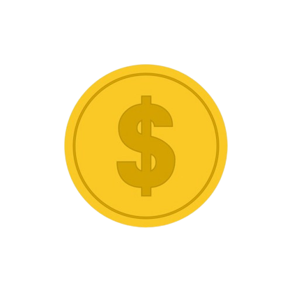

<div align="center">



<h1>SaldoMais</h1>

<p><strong>Gastos claros, decisões inteligentes.</strong></p>

[](https://mat7heus.github.io/SaldoMais)


</div>

---

**SaldoMais** é uma aplicação **client-side** de finanças pessoais — sem backend, sem cadastro, sem instalação. Tudo roda no navegador com dados persistidos via `localStorage`.

Desenvolvida com **HTML, CSS e JavaScript puro** (Vanilla JS), a aplicação cobre o ciclo completo de controle financeiro: do registro de despesas à simulação de investimentos.

---

## Funcionalidades

| Módulo | Descrição |
|---|---|
| **Dashboard** | Visão geral do orçamento com gráfico de distribuição por categoria |
| **Lançamentos** | Registro e histórico de despesas categorizadas |
| **Categorias** | CRUD de categorias com distribuição percentual do orçamento |
| **Calculadoras** | 8 calculadoras financeiras: juros compostos, CDB, financiamento e mais |
| **Gastos Fixos** | Cadastro de despesas recorrentes aplicadas automaticamente |
| **Receitas** | Registro de entradas mensais |
| **Carteira** | Montagem de carteira de investimentos com perfil de risco, simulador e histórico de aportes |
| **Exportação** | Relatório mensal em PDF e backup/restauração dos dados em JSON |

---

## Tecnologias

| Tecnologia | Finalidade |
|---|---|
| HTML5 + CSS3 + JavaScript (Vanilla) | Interface e lógica da aplicação |
| [Chart.js](https://www.chartjs.org/) | Gráficos interativos |
| [ECharts](https://echarts.apache.org/) | Gráfico de distribuição hierárquica (sunburst) |
| [jsPDF](https://github.com/parallax/jsPDF) | Geração de relatórios PDF client-side |
| [Lucide Icons](https://lucide.dev/) | Ícones SVG |

---

## Acesso

A aplicação está disponível em:

**[mat7heus.github.io/SaldoMais](https://mat7heus.github.io/SaldoMais)**

Não é necessário servidor, conta de usuário ou conexão contínua com a internet após o carregamento inicial.

---

## Executando localmente

```bash
git clone https://github.com/mat7heus/SaldoMais.git
```

Abra o arquivo `webapp.html` diretamente no navegador. Nenhum build step ou dependência local necessária.

---

## Estrutura do projeto

```
SaldoMais/
├── webapp.html          # Aplicação principal
├── images/              # Assets visuais
├── styles/              # Folhas de estilo
├── scripts/             # Lógica da aplicação
│   ├── modules/         # Módulos do sistema
│   └── utils/           # Utilitários
├── services/            # Serviços (PDF, exportação)
├── pages/               # Páginas/views
└── README.md
```

---

## Licença

Distribuído sob a licença **[GPL v3](LICENSE)**.
